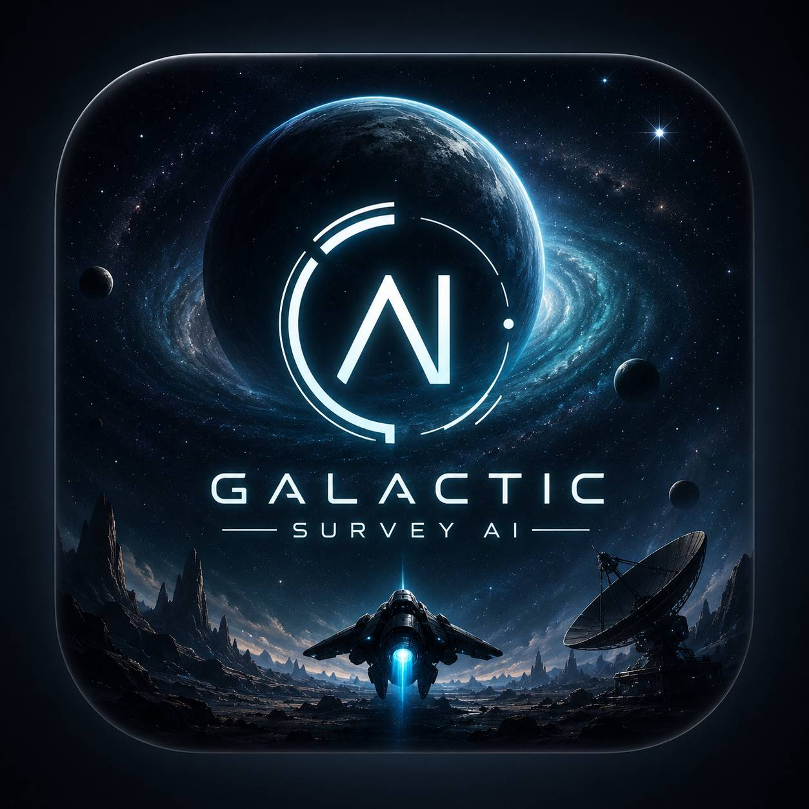

  

🚀 Galactic Survey AI

An AI-Powered Space Exploration Game Combining Game Development, Artificial Intelligence, and Astrophysics

⸻

🌌 Overview

Galactic Survey AI is a scientific space exploration game developed as a Telegram Mini App.

In this game, players take the role of a space commander leading an exploration mission into unknown regions of the galaxy. Their mission is to discover new star systems, analyze exoplanets, collect scientific data, develop new technologies, and uncover the hidden mysteries of the universe.

Unlike traditional resource-management games, Galactic Survey AI focuses on scientific exploration and decision-making by combining:

* Game Development
* Artificial Intelligence
* Machine Learning
* Astrophysics
* Planetary Science

The main goal of the project is to create an interactive universe where players experience the process of scientific discovery and exploration.

⸻

📖 Story

“The Last Message From The Stars”

The year is 2419.

Humanity has achieved interstellar travel and finally reached beyond the limits of the Solar System. However, despite centuries of scientific progress, one fundamental question remains unanswered:

Are we alone in the universe?

To answer this question, humanity launches a secret scientific mission called:

Galactic Survey Initiative

The player becomes the commander of the spacecraft Astra-01, one of the first exploration vessels sent into unknown regions of the Milky Way.

The spacecraft is equipped with an advanced artificial intelligence system called Astra, designed to analyze cosmic data, manage ship systems, and assist the commander in making scientific decisions.

The mission begins as a normal exploration project, but after discovering mysterious signals, ancient structures, and unexplained astronomical phenomena, the player realizes that the galaxy contains secrets far older than humanity itself.

The deeper the exploration goes, the closer the player gets to discovering the truth hidden among the stars.

⸻

🎮 Core Gameplay

Players begin with:

* An exploration spacecraft
* Basic scanner
* Limited fuel and energy
* Research equipment
* AI assistant system

The player must explore unknown regions of space and decide:

* Which star system is worth exploring?
* Which planet has scientific value?
* When should they take risks?
* Which technologies should be developed?

Every decision has different costs, risks, and rewards.

Main gameplay activities:

* Discover new star systems
* Scan planets
* Analyze planetary environments
* Send research probes
* Collect resources
* Gather scientific data
* Upgrade spacecraft systems
* Unlock advanced technologies

⸻

🌠 Procedural Galaxy Generation

The galaxy is generated using procedural generation algorithms.

Each star system contains unique characteristics:

* Star type
* Star temperature
* Star mass
* Star age
* Number of planets
* Planet distances
* Surface temperature
* Atmospheric composition
* Radiation level
* Water probability
* Resource distribution

The generation system is inspired by real astrophysical concepts.

Examples:

* M-type stars are more likely to contain rocky planets.
* Planets inside the habitable zone have higher chances of liquid water.
* Young stars have stronger stellar activity.
* Close planets receive higher radiation levels.

⸻

🪐 Scientific Planet Analysis

Every planet receives a scientific evaluation based on planetary parameters.

The Habitability Score is calculated using:

* Temperature
* Atmospheric pressure
* Atmospheric composition
* Distance from star
* Radiation level
* Water availability

Example:

Planet X-421
Habitability Score: 73%
Water Probability: High
Radiation Risk: Medium
Scientific Value: High

Players can use scientific information to make better exploration decisions.

⸻

🤖 Artificial Intelligence System

Artificial Intelligence is one of the main features of Galactic Survey AI.

AI Space Assistant

Every spacecraft contains an AI Core called Astra.

The AI helps the player by:

* Analyzing planets
* Predicting mission risks
* Suggesting exploration targ
